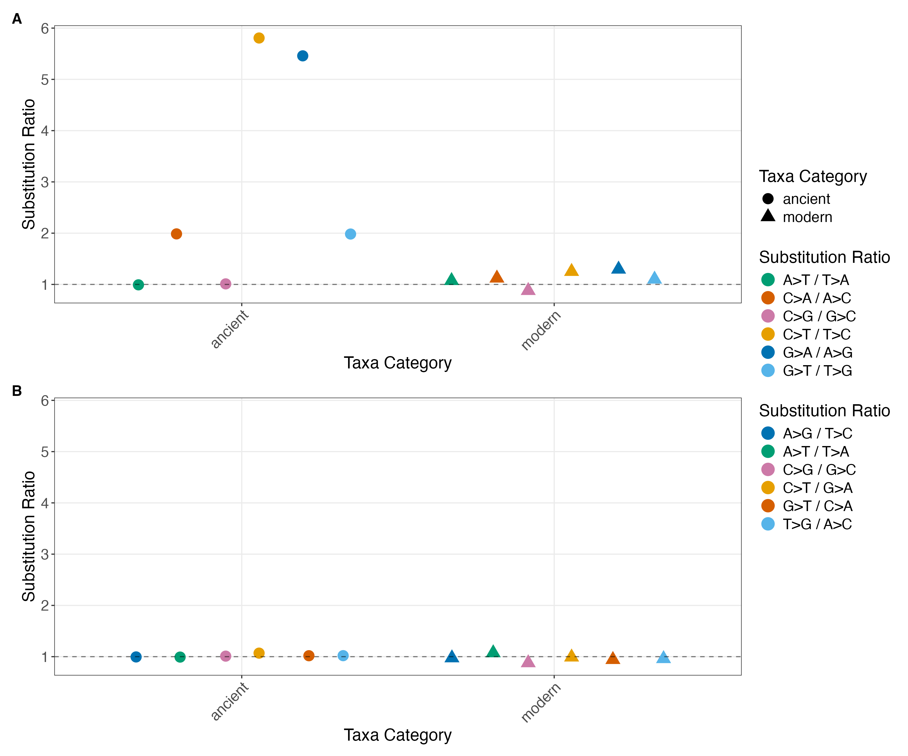

# Aggregate symmetry analysis

Ancient vs modern substitution symmetry pooled across taxa, as used in Lemmon-Kishi et al.
(2026), Sections 4.2.1 and 4.2.3 (Table 2, Fig. 3, Supp. Figs S6–S7).

| Script | Language | Does |
| --- | --- | --- |
| [`scripts/analyze_substitutions_patterns_aggregate.py`](scripts/analyze_substitutions_patterns_aggregate.py) | Python | Counts substitutions per read in one BAM, with the read's tax ID |
| [`scripts/symmetry_tests.R`](scripts/symmetry_tests.R) | R | Pools reads into ancient and modern, then runs ratio plots, χ² tests and permutation tests |

- [Quick start](#quick-start)
- [Example data](#example-data)
- [Method](#method)
- [Step 1: per-read substitution counts](#step-1-per-read-substitution-counts)
- [Step 2: symmetry tests](#step-2-symmetry-tests)
- [Outputs](#outputs)
- [Caveats](#caveats)

## Quick start

From the repository root, count substitutions per read in each example BAM:

```bash
mkdir -p aggregate/example/reads
for bam in aggregate/example/bams_downsampled/*.bam; do
  name=$(basename "$bam" .bam)
  python aggregate/scripts/analyze_substitutions_patterns_aggregate.py "$bam" \
    -s aggregate/example/reads/${name}_stats.txt \
    -c aggregate/example/reads/${name}_summary.csv \
    -r aggregate/example/reads/${name}_reads.csv
done
```

Then run the symmetry tests with contaminant (control) taxa removed, as in the paper:

```bash
Rscript aggregate/scripts/symmetry_tests.R aggregate/example/reads --ancient-taxa aggregate/example/ancient_taxa_id.csv --control-taxa aggregate/example/control_taxa.csv --modern-taxa aggregate/example/nonControl_modern_taxa.csv -o aggregate/example/expected
```

Or keep the control taxa in the modern pool by leaving out `--control-taxa`:

```bash
Rscript aggregate/scripts/symmetry_tests.R aggregate/example/reads --ancient-taxa aggregate/example/ancient_taxa_id.csv --modern-taxa aggregate/example/nonControl_modern_taxa.csv -o aggregate/example/expected
```

The CSV and text results should match the files in [`example/expected/`](example/expected/).
`example/reads/` (~120 MB) is not tracked by git; the loop above regenerates it.

## Example data

| File | Description |
| --- | --- |
| [`example/bams_downsampled/`](example/bams_downsampled/) | 29 Kap København libraries (one BAM each), downsampled; each read's RNAME is its tax ID |
| [`example/ancient_taxa_id.csv`](example/ancient_taxa_id.csv) | 92 taxa classified as ancient |
| [`example/control_taxa.csv`](example/control_taxa.csv) | 35 modern taxa that are more abundant in the negative controls (contaminants) |
| [`example/nonControl_modern_taxa.csv`](example/nonControl_modern_taxa.csv) | 4 modern taxa that remain after removing contaminants |
| [`example/expected/`](example/expected/) | outputs of the two `symmetry_tests.R` commands above |

The taxa lists come from classifying taxa by damage, sequence complexity (DUST) and read
count, then flagging modern taxa that are more abundant in the negative controls (paper
Section 4.5.1). The scripts for that step are in
[lemmonquiche/ratePlacer](https://github.com/lemmonquiche/ratePlacer).

**Downsampling.** Modern reads are rare (about 1 per 34,000 ancient reads), so a uniform
subsample would leave almost none. The BAMs were instead downsampled by category: all
modern reads were kept, along with a seeded random 0.1% of ancient reads and 2% of
control-taxon reads. Unmapped, secondary and supplementary records were dropped.

As a result, ratios computed within each pool match the full data closely. The modern ratios
are identical to the paper's, and the ancient ratios are within about 3%. For example,
C → T / T → C is 5.81 in ancient reads and 1.25 in modern reads, against the paper's 5.74
and 1.25. Statistics that depend on pool size (χ² p-values, Cramér's V and permutation
p-values) do **not** match the paper, because the ancient pool is about 1,000× smaller.



*`example/expected/controls_removed_ratios_combined.png` (paper Fig. 3): (A) symmetric
pairs, where ancient reads show excess C → T and G → A (deamination) and C → A and G → T
(oxidation), while modern reads stay near 1; (B) Watson-Crick complement pairs, near 1
in both.*

## Method

Reads are pooled into two categories by tax ID: **ancient** (in `--ancient-taxa`) and
**modern** (everything else). With `--control-taxa`, taxa found as contaminants in
negative controls are removed first, so the modern pool contains only non-contaminant
taxa (paper Section 4.5.1). Two sets of substitution pairs are compared:

| Set | Pairs | Expected ratio | Departure indicates |
| --- | --- | --- | --- |
| Complementary (symmetric) | i → j vs j → i, e.g. C → T vs T → C | 1 under time-reversible evolution (detailed balance) | substitution-specific damage |
| Watson-Crick complement | i → j vs its complement, e.g. C → T vs G → A | 1 in double-stranded libraries, where strand of origin is lost | strand-specific sequencing or alignment bias |

For each set the script runs three analyses:

1. **Ratio plots.** Each pair's ratio Rᵢⱼ = Nᵢⱼ / Nⱼᵢ, pooled over all reads in each
   category.
2. **χ² tests.** For each pair, a 2×2 table (ancient/modern × the two substitutions) tested
   for independence with Yates' correction, plus Cramér's V. With hundreds of millions of
   reads even negligible differences are significant, so compare Cramér's V across pairs
   to rank which asymmetries are largest.
3. **Permutation tests.** The test statistic is the difference in a pair's ratio between
   pools, R(ancient) − R(modern). Ancient/modern labels are shuffled across reads (keeping
   the pool sizes) to build a null distribution. The two-sided p-value is

   p = (b + 1) / (m + 1)

   where *b* is the number of permutations with |difference| ≥ the observed |difference|
   and *m* is the number of permutations. The observed labelling counts as one
   permutation, so p is never 0; its smallest value is 1/(m + 1), about 1.0 × 10⁻⁴ for
   10,000 permutations (Phipson & Smyth 2010).

## Step 1: per-read substitution counts

```
analyze_substitutions_patterns_aggregate.py BAM [-r READS_CSV] [-c SUMMARY_CSV] [-s STATS_TXT] [options]
```

Run once per library. The BAM's RNAME (reference name) must be the tax ID. In the paper,
these are the `bamdam extract --only-top-alignment` BAMs. Reference bases come from the
MD tag, and reverse-strand reads are corrected to the original orientation.

| Option | Description |
| --- | --- |
| `-r, --reads-output FILE` | Per-read CSV: `read_name`, `tax_id`, reference base counts and the 12 substitution counts. **This is the input to step 2.** Name it `*_reads.csv`. |
| `-c, --csv-output FILE` | Per-taxon summary CSV (default: stdout) |
| `-s, --stats-output FILE` | Human-readable report per taxon (default: stdout) |
| `-o, --error-log FILE` | Reads whose reference sequence could not be reconstructed |
| `--no-strand-correction` | Count reverse-strand reads in reference orientation |

Unmapped, secondary and supplementary records are skipped. The report warns if any read
name occurs more than once.

## Step 2: symmetry tests

### From the command line

```
Rscript symmetry_tests.R READS_DIR --ancient-taxa FILE [options]
```

| Option | Default | Description |
| --- | --- | --- |
| `READS_DIR` | — | Directory with the per-read CSVs from step 1 |
| `--ancient-taxa FILE` | required | CSV with a `taxa_id` column; all other taxa are modern |
| `--control-taxa FILE` | none | Contaminant taxa to remove from the modern pool. Leave out to keep all taxa. |
| `--modern-taxa FILE` | none | Expected modern taxa, used only as a consistency check (see below) |
| `-o, --outdir DIR` | `.` | Output directory |
| `--pattern REGEX` | `_reads\.csv$` | Which files in `READS_DIR` to read |
| `--min-sub-count NUM` | 100 | A category is plotted only if every substitution type has at least this many counts |
| `--permutations NUM` | 10000 | Number of permutations |
| `--cores NUM` | 4 | Cores for the permutations (must be 1 on Windows) |
| `--seed NUM` | 42 | Random seed |
| `--perm-cache FILE` | none | `.rds` file to save permutations to. Reused when the data and settings match, overwritten otherwise. |
| `--ylim MIN,MAX` | fit the data | y-axis range of the ratio plots (see [Outputs](#outputs)) |
| `-h, --help` | | Show usage |

The `--modern-taxa` check compares the modern taxa in the data with the list:
- **With `--control-taxa`:** they should match exactly, and any modern taxon not on the
  list is a warning.
- **Without `--control-taxa`:** the extra taxa are expected (they are the control taxa)
  and are only reported.
- **In both modes:** listed taxa with no reads trigger a warning.

Permutation results depend on `--seed` and `--cores`: worker *k* uses seed + *k*. Use
the same values to reproduce a run exactly.

### From R or RStudio

```r
source("aggregate/scripts/symmetry_tests.R")
res <- run_symmetry_tests("aggregate/example/reads",
                          ancient_taxa = "aggregate/example/ancient_taxa_id.csv",
                          control_taxa = "aggregate/example/control_taxa.csv",
                          outdir = "results")
res$ratio_plots$combined     # show the ratio figure
res$chisq_results            # χ² table
```

`run_symmetry_tests()` takes the same options as the command line, using `_` instead of
`-` in names (`min_sub_count`, `n_perm`, `ncores`, `seed`, `perm_cache`,
`ylim = c(MIN, MAX)`, ...). It writes the same files and returns the summarized counts,
tables and plots.

## Outputs

All files are prefixed `controls_removed_` (with `--control-taxa`) or `controls_included_`
(without). `SET` is `complementary` or `watson_crick`.

| File | Contents |
| --- | --- |
| `ratios_SET.png`, `ratios_combined.png` | Pair ratios in ancient and modern reads; the combined figure is paper Fig. 3 |
| `chisq_results.csv` | One row per pair: χ², p-value, ancient and modern ratios, their difference, and Cramér's V (paper Table 2) |
| `chisq_detailed.txt` | Full `chisq.test` output per pair: observed, expected and standardized residuals |
| `permutation_results_SET.csv` | One row per ratio: pool sizes, ancient and modern ratios, observed difference, p-value, significance stars |
| `permutation_distributions_SET.png` | Null distribution of each ratio difference, with the observed value marked (paper Supp. Figs S6–S7) |

Both ratio panels share one y-axis range so they can be compared. By default it spans
every plotted ratio and 1 (the symmetry line). `--ylim` sets it manually; this only
zooms the view, so a ratio outside the range is cut off from view rather than removed.

In `chisq_results.csv`, ratios are the first substitution in the pair name over the
second, e.g. `AC_CA` is A → C / C → A. The plots and permutation results use the
orientation shown in their labels, e.g. `C>A / A>C`, so some ratios appear inverted
between the two.

## Caveats

- **Windows.** Permutations run in parallel with `mclapply`, which needs process forking.
  On Windows use `--cores 1`.
- **Memory.** Every read is loaded into memory. The paper's ~198 million reads need
  several GB of RAM.
