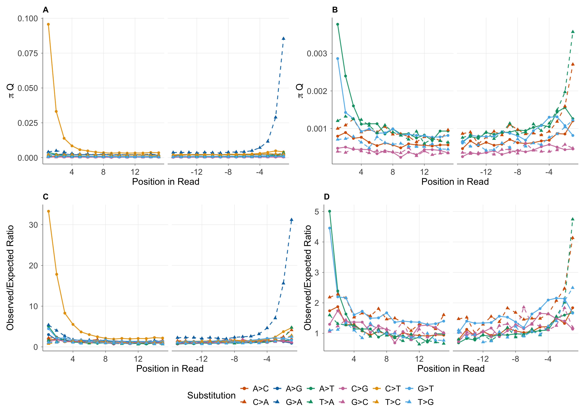

# Single-taxon substitution analysis

Aggregate and positional substitution counts and observed-to-expected ratios for a
single BAM (one taxon), as used in Lemmon-Kishi et al. (2026).

| Script | Language | Does |
| --- | --- | --- |
| [`scripts/calc_subs.py`](scripts/calc_subs.py) | Python | Counts substitutions from a BAM and computes observed-to-expected ratios |
| [`scripts/viewExcess.R`](scripts/viewExcess.R) | R | Plots the positional output of `calc_subs.py` (paper Fig. 2) |

- [Quick start](#quick-start)
- [Example data](#example-data)
- [Overview](#overview)
- [Command-line options](#command-line-options)
- [Input files](#input-files)
- [Method](#method)
- [Outputs](#outputs)
- [Plotting](#plotting)
- [Interpreting the output](#interpreting-the-output)
- [Caveats](#caveats)

## Quick start

Alignments need MD tags. If yours don't have them:

```bash
samtools calmd -b sample.bam reference.fa > sample.md.bam
```

From the repository root, run on the included example data under GTR, with positional
output for the first and last 15 bases:

```bash
python single_taxon/scripts/calc_subs.py single_taxon/example/example.bam --gtr-params single_taxon/example/gtr_params.txt --output ex_gtr.tsv --pos-output ex_gtr_pos.csv --pos-bases ex_gtr_bases.csv
```

Under UNREST:

```bash
python single_taxon/scripts/calc_subs.py single_taxon/example/example.bam --unrest-params single_taxon/example/unrest_params.txt --output ex_unrest.tsv --pos-output ex_unrest_pos.csv --pos-bases ex_unrest_bases.csv
```

Counts only:

```bash
python single_taxon/scripts/calc_subs.py single_taxon/example/example.bam --output ex.tsv --pos-output ex_pos.csv --pos-bases ex_bases.csv
```

Then plot the positional output (writes `ex_gtr_figure.png` next to the input):

```bash
Rscript single_taxon/scripts/viewExcess.R ex_gtr_pos.csv
```

The results should match the files in [`example/expected/`](example/expected/).

## Example data

| File | Description |
| --- | --- |
| [`example/example.bam`](example/example.bam) | 103,065 reads (~4.6 million aligned bases), a random subsample of nuclear reads from ancient *Betula* |
| [`example/gtr_params.txt`](example/gtr_params.txt) | GTR+Γ parameters |
| [`example/unrest_params.txt`](example/unrest_params.txt) | UNREST directed rates |
| [`example/expected/`](example/expected/) | expected outputs of the commands above: `ex*.tsv`, `ex*_pos.csv` and `ex*_bases.csv` from `calc_subs.py`, and `ex*_figure.png` from `viewExcess.R` |

Even in this subsample, the damage signatures described in the paper are visible in the
observed-to-expected ratios under GTR (`expected/ex_gtr.tsv`): C → T (4.09) and G → A
(3.83) are highest, followed by C → A (1.57) and G → T (1.54). Their reverse
substitutions (T → C, A → G, A → C, T → G) stay between 1.00 and 1.25.

## Overview

[`scripts/calc_subs.py`](scripts/calc_subs.py) counts reference → read mismatches in a BAM/SAM file, using the MD
tag to recover the reference base at each aligned position. It runs in one of three
modes:

| Mode | Flag | What is reported |
| --- | --- | --- |
| Counts only | *(none)* | observed counts, observed rates, πQ |
| GTR | `--gtr-params FILE` | the above, plus expected counts and observed-to-expected ratios under GTR |
| UNREST | `--unrest-params FILE` | the above, plus expected counts and observed-to-expected ratios under the non-reversible UNREST model |

`--gtr-params` and `--unrest-params` are mutually exclusive.

## Command-line options

```
calc_subs.py INPUT [--gtr-params FILE | --unrest-params FILE] [options]
```

| Option | Default | Description |
| --- | --- | --- |
| `INPUT` | — | SAM or BAM file (format auto-detected). Must carry MD tags. `@SQ` headers are not required. |
| `--gtr-params FILE` | none | GTR parameter file. See [GTR parameter file](#gtr-parameter-file). |
| `--unrest-params FILE` | none | UNREST parameter file. See [UNREST parameter file](#unrest-parameter-file). |
| `--no-strand-correction` | off | Keep reverse-strand mappings in reference orientation instead of correcting them to the original forward orientation. |
| `--min-baseq INT` | 0 | Skip bases with base quality below this value. |
| `--min-mapq INT` | 0 | Skip reads with mapping quality below this value. |
| `--output FILE` | none | Also write the aggregate per-substitution table as TSV. |
| `--pos-output FILE` | none | Write the positional substitution CSV. Enables positional counting. |
| `--pos-bases FILE` | none | Write the positional base-composition CSV. **Ignored unless `--pos-output` is also given.** |
| `--max-pos INT` | 15 | Number of positions from each read terminus to include in positional output. |

The report goes to stdout. Progress messages, the loaded model parameters, the
normalization factor and errors go to stderr.

## Input files

### Alignment

Reference bases are recovered from the MD tag via pysam's
`get_aligned_pairs(with_seq=True)`. If a read has no MD tag, the script stops with an
error. To add MD tags:

```bash
samtools calmd -b in.bam ref.fa > out.bam
```

The following are skipped:

- unmapped, secondary and supplementary alignments
- reads with no stored sequence
- insertions, deletions and other non-matching CIGAR operations (only aligned pairs are used)
- positions where the reference or read base is not A/C/G/T

In the paper, the input BAMs are the per-genus nuclear reads remaining after competitive
mapping, taxonomic assignment and ancient/modern classification (paper Section 4.5.1).

### GTR parameter file

Parameters of a GTR+Γ model fit to the reference phylogeny (in the paper, estimated with
`phangorn::pml` followed by `optim.pml`, see [lemmonquiche/ratePlacer](https://github.com/lemmonquiche/ratePlacer) for scripts). Four lines, read by line number; blank lines
and comments are not allowed.

```
0.7809764
0.32482897 0.17562236 0.17556944 0.32397923
0.9943923 2.727291 0.8342608 1.120981 2.725634
1
```

| Line | Contents | Used? |
| --- | --- | --- |
| 1 | gamma shape α | no |
| 2 | stationary frequencies A C G T | logged only |
| 3 | exchangeabilities AC AG AT CG CT | yes |
| 4 | exchangeability GT | yes |

The stationary frequencies in the file are **not** used. πᵢ is taken from the reference
bases at positions covered by the aligned reads (see [Method](#method)).

### UNREST parameter file

The 12 directed rates of a non-reversible UNREST model (e.g. IQ-TREE `UNREST+G4`). One
line per rate in the form `SOURCE-TARGET: rate`, in any order. Blank lines are ignored;
all 12 are required.

```
A-C: 1.003
A-G: 2.912
A-T: 1.628
C-A: 2.047
C-G: 1.192
C-T: 5.289
G-A: 5.295
G-C: 1.189
G-T: 2.047
T-A: 1.636
T-C: 2.908
T-G: 1.000
```

## Method

### Strand-aware counting

By default, every base from a reverse-strand mapping is complemented (both the reference
base and the read base), so counts are reported in the original forward orientation of
the molecule. For example, a G → A mismatch on a reverse-strand mapping is counted as
C → T. Use `--no-strand-correction` to count in reference orientation instead.

### Observed rates

For each reference base *i* and read base *j*:

- `obs_count` Nᵢⱼ: number of aligned positions with reference *i* and read *j*
- `ref_count` nπᵢ: number of aligned reference bases of type *i*, where *n* is the total
  number of aligned reference bases and πᵢ their frequency
- `obs_rate` = Nᵢⱼ / nπᵢ
- `pi_q` (πQ) = Nᵢⱼ / *n* = πᵢ × `obs_rate`

πᵢ and *n* are computed from the reference bases at positions covered by the aligned
reads. The expected counts are therefore computed over the same set of bases as the
observed counts.

### Expected counts

The expected count of i → j substitutions is nπᵢQᵢⱼt. Elapsed evolutionary time *t* is
unknown, but it is a global scale that cancels when ratios are compared across
substitution types, so it is set to 1. The two models differ only in Qᵢⱼ:

| | GTR | UNREST |
| --- | --- | --- |
| Parameters | 6 exchangeabilities sᵢⱼ (AC, AG, AT, CG, CT, GT) | 12 directed rates Rᵢⱼ |
| Qᵢⱼ | sᵢⱼ × πⱼ | Rᵢⱼ (up to a constant) |
| πⱼ | from the data (whole-read, or per position) | not used |
| Detailed balance (πᵢQᵢⱼ = πⱼQⱼᵢ) | yes | no |

For UNREST there is no target-frequency factor: the off-diagonal entries of IQ-TREE's
reported UNREST Q matrix are the directed rates up to a constant.

The overall scale of Q and *t* is absorbed by a single normalization factor *k*, chosen
so the total expected count over all 12 substitution types equals the total observed
count:

```
k = Σ Nᵢⱼ / Σ nπᵢ · Qᵢⱼ
expected_rate(i → j)  = k · Qᵢⱼ
expected_count(i → j) = expected_rate(i → j) · nπᵢ
```

### Observed-to-expected ratios

Oᵢⱼ = Nᵢⱼ / `expected_count`, **scaled so that the smallest ratio across the 12
substitution types is 1.00** (as in paper Table 1). Assuming approximately equal elapsed
time across reads, Oᵢⱼ should be roughly uniform across substitution types without
damage, so substitution types with high ratios point to post-mortem misincorporation.

Positional ratios are scaled by the same constant as the aggregate table, so they can be
compared directly with the aggregate ratios.

### Positional analysis

When `--pos-output` is given, each base is also assigned read-terminus positions:

- `1 … max_pos`: distance from the 5′ terminus (1 = first base)
- `-1 … -max_pos`: distance from the 3′ terminus (-1 = last base)

With strand-aware counting (the default), positions refer to the original molecule: for
reverse-strand mappings, the read is flipped before positions are assigned. With
`--no-strand-correction`, positions follow alignment orientation.

Positional expected rates use the same *k* as the aggregate table. Under GTR, πⱼ is the
local reference base composition at that position. Under UNREST, the directed rate is
used directly.

## Outputs

### Stdout report

1. **Reference base coverage**: count and proportion (πᵢ) of each reference base.
2. **Substitution matrix**: 4×4 reference → observed counts, with per-reference-base
   mismatch rates.
3. **Per-substitution rates**: one row per substitution type (see TSV columns below).
   Expected columns are shown only when a model is given.
4. **Summary**: overall mismatch rate, and total matches and mismatches.

### `--output` TSV (aggregate)

| Column | Description |
| --- | --- |
| `sub_type` | e.g. `C→T` |
| `obs_count` | Nᵢⱼ |
| `ref_count` | nπᵢ |
| `obs_rate` | Nᵢⱼ / nπᵢ |
| `expected_rate` | k · Qᵢⱼ (`NA` without a model) |
| `expected_count` | `expected_rate` × nπᵢ (`NA` without a model) |
| `obs_exp_ratio` | scaled observed-to-expected ratio, min = 1.00 (`NA` without a model) |
| `pi_q` | observed rate πQ = Nᵢⱼ / *n* |

### `--pos-output` CSV (positional)

One row per (position, substitution) for which the reference base was seen at that position.

| Column | Description |
| --- | --- |
| `position` | 1…N (5′) or −1…−N (3′) |
| `position_type` | `5prime` or `3prime` |
| `substitution` | e.g. `C>T` |
| `ref_base`, `obs_base` | reference and read bases |
| `observed_count`, `ref_count`, `observed_rate` | as above, restricted to this position |
| `expected_rate`, `expected_count` | 0 without a model |
| `obs_exp_ratio` | scaled by the aggregate minimum; `inf` if expected is 0 and observed > 0 (so always `inf` or 0 without a model) |
| `pi_q` | πQ at this position = `observed_count` / bases at this position |

### `--pos-bases` CSV (positional base composition)

One row per position. Does not depend on the model.

| Column | Description |
| --- | --- |
| `position` | as above |
| `ref_A` … `ref_T`, `ref_total` | reference base frequencies and total at this position |
| `obs_A` … `obs_T`, `obs_total` | read base frequencies and total at this position |

## Plotting

[`scripts/viewExcess.R`](scripts/viewExcess.R) plots the `--pos-output` CSV as a
four-panel figure (paper Fig. 2), with 5′ and 3′ positions side by side in each panel:

| Panel | Shows | Substitutions |
| --- | --- | --- |
| A | observed rate (πQ) | all 12 |
| B | observed rate (πQ) | excluded pairs removed (default: deamination, C ↔ T and G ↔ A) |
| C | observed-to-expected ratio | all 12 |
| D | observed-to-expected ratio | excluded pairs removed |

Each symmetric pair shares a color. The solid line is one direction and the dashed line
its reverse (e.g. solid C → T vs dashed T → C). Under symmetry, matched solid and dashed
lines should overlap in A and B, and all lines should overlap in C and D. Deamination is
removed from B and D because its scale hides the smaller signals.



*`example/expected/ex_gtr_figure.png`: besides deamination (A, C), panels B and D show
excess G → T at the 5′ end and C → A at the 3′ end (oxidative damage), and a terminal-base
excess of A → T / T → A.*

Panels C and D need expected rates, i.e. `calc_subs.py` run with `--gtr-params` or
`--unrest-params`. For counts-only input, the script warns and draws panels A and B only.

### From the command line

The figure is always saved:

```bash
Rscript single_taxon/scripts/viewExcess.R ex_gtr_pos.csv -o fig2.pdf
```

| Option | Default | Description |
| --- | --- | --- |
| `INPUT` | — | `--pos-output` CSV from `calc_subs.py` |
| `-o, --output FILE` | `INPUT` with `_pos.csv` replaced by `_figure.png` | Output file; format from the extension (`.png`, `.pdf`, `.svg`, ...) |
| `-e, --exclude PAIRS` | `CT,AG` | Comma-separated pairs removed from panels B and D, written as `CT` or `C<>T` (quote `<>` in the shell); `none` removes nothing |
| `--width NUM` | 14 | Figure width in inches |
| `--height NUM` | 10 (5 for counts-only) | Figure height in inches |
| `--dpi NUM` | 300 | Resolution for raster formats |
| `-h, --help` | | Show usage |

### From R or RStudio

Sourcing the script only defines `view_excess()`. Calling it shows the figure, and saves
it only if `output` is given:

```r
source("single_taxon/scripts/viewExcess.R")
view_excess("ex_gtr_pos.csv")                            # show only
view_excess("ex_gtr_pos.csv", output = "fig2.pdf")       # show and save
view_excess("ex_gtr_pos.csv", exclude = "none")          # keep deamination in B and D
p <- view_excess("ex_gtr_pos.csv", show = FALSE)         # ggplot object to modify
```

`view_excess()` takes the same options as the command line (`output`, `exclude`,
`width`, `height`, `dpi`), plus `show`.

## Interpreting the output

The ratios below can be computed from the `obs_count` column (aggregate) or the
`observed_count` column (positional).

- **Symmetric pairs** (i → j vs j → i, e.g. C → T vs T → C): Rᵢⱼ = Nᵢⱼ / Nⱼᵢ should be
  about 1 under a time-reversible substitution process. An excess of one direction points
  to damage.
- **Watson-Crick complement pairs** (e.g. C → T vs G → A, G → T vs C → A): in
  double-stranded libraries the strand of origin is lost, so complement pairs should
  occur at about 1:1. A deviation suggests strand-specific sequencing or alignment bias.
  This check does not apply to single-stranded libraries, which preserve the strand of
  origin.

Expected damage signatures:

| Damage | Double-stranded libraries | Single-stranded libraries |
| --- | --- | --- |
| Deamination | C → T at 5′, G → A at 3′ | C → T at both termini |
| Oxidation of guanine (8-oxoguanine) | G → T at 5′, C → A at 3′ | not characterized in the paper |

In the paper, both signatures are strongest at the termini but remain elevated across
the read interior. Plotting positional πQ and observed-to-expected ratios for each
direction of a pair makes symmetry violations visible (paper Fig. 2; see
[Plotting](#plotting)).

## Caveats

- **Short reads**: if a read is shorter than `2 × max_pos`, a base can fall in both a
  5′ bin and a 3′ bin, so it is counted in both.
- **Soft clipping**: positions are measured from the ends of the full query sequence,
  including soft-clipped bases. On soft-clipped reads, position 1 may not be the first
  *aligned* base.
- **Filters**: `--min-mapq` removes whole reads. `--min-baseq` removes individual bases.
  Both default to 0, so nothing is filtered unless you set them.
- **GTR file parsing** is by line index, so a blank line or a comment will cause a
  parse error.
- **Counts-only positional output** fills `expected_rate`/`expected_count` with 0 and
  `obs_exp_ratio` with `inf`/0. These columns are meaningless without a model.
